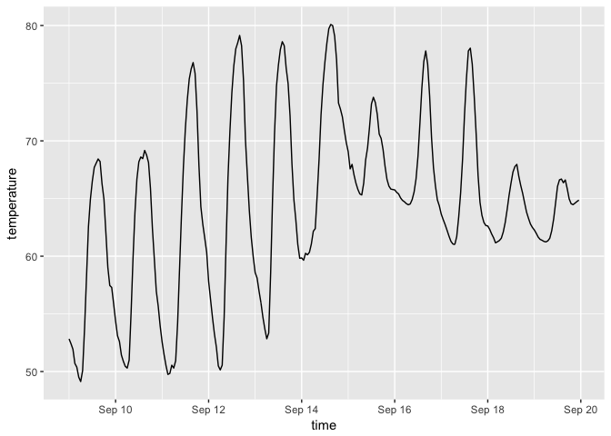
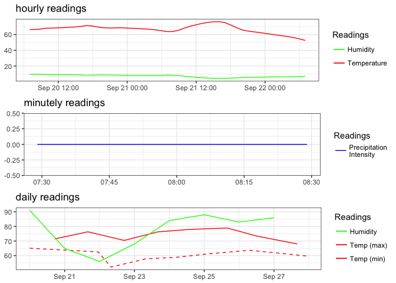

[](http://www.repostatus.org/#active) [](https://travis-ci.org/hrbrmstr/darksky) [](https://cran.r-project.org/package=darksky) 

`darksky` : Tools to Work with the Dark Sky API

-   Dark Sky API Docs: <https://darksky.net/dev/docs>
-   Dark Sky Dev site: <https://darksky.net/dev/>

The following functions are implemented:

-   `darksky_api_key` : Get or set `DARKSKY_API_KEY` value
-   `get_current_forecast` : Retrieve the current forecast (for the next week)
-   `get_forecast_for` : Retrieve weather data for a specific place/time
-   `plot.darksky` : Plot method for `darksky` objects
-   `print.darksky` : A tad more human readable default printing

### Installation

``` r
devtools::install_github("hrbrmstr/darksky")
```

OR

``` r
devtools::install.packages("darksky")
```

### Usage

``` r
library(darksky)
library(ggplot2)
library(purrr)

# current verison
packageVersion("darksky")
```

    ## [1] '1.2.0'

``` r
now <- get_current_forecast(43.2672, -70.8617)
print(now)
```

    ## minutely 
    ## ======================================================================================================================== 
    ## Observations: 61
    ## Variables: 5
    ## $ time                 <dttm> 2017-06-29 12:17:00, 2017-06-29 12:18:00, 2017-06-29 12:19:00, 2017-06-29 12:20:00, 2...
    ## $ precipIntensity      <dbl> 0.000, 0.000, 0.000, 0.000, 0.000, 0.000, 0.000, 0.000, 0.000, 0.000, 0.000, 0.000, 0....
    ## $ precipProbability    <dbl> 0.00, 0.00, 0.00, 0.00, 0.00, 0.00, 0.00, 0.00, 0.00, 0.00, 0.00, 0.00, 0.00, 0.00, 0....
    ## $ precipIntensityError <dbl> NA, NA, NA, NA, NA, NA, NA, NA, NA, NA, NA, NA, NA, NA, NA, NA, NA, NA, NA, NA, NA, NA...
    ## $ precipType           <chr> NA, NA, NA, NA, NA, NA, NA, NA, NA, NA, NA, NA, NA, NA, NA, NA, NA, NA, NA, NA, NA, NA...
    ## 
    ## hourly 
    ## ======================================================================================================================== 
    ## Observations: 49
    ## Variables: 18
    ## $ time                <dttm> 2017-06-29 12:00:00, 2017-06-29 13:00:00, 2017-06-29 14:00:00, 2017-06-29 15:00:00, 20...
    ## $ summary             <chr> "Overcast", "Mostly Cloudy", "Mostly Cloudy", "Mostly Cloudy", "Mostly Cloudy", "Overca...
    ## $ icon                <chr> "cloudy", "partly-cloudy-day", "partly-cloudy-day", "partly-cloudy-day", "partly-cloudy...
    ## $ precipIntensity     <dbl> 0.0000, 0.0034, 0.0000, 0.0000, 0.0000, 0.0000, 0.0020, 0.0015, 0.0019, 0.0000, 0.0032,...
    ## $ precipProbability   <dbl> 0.00, 0.01, 0.00, 0.00, 0.00, 0.00, 0.01, 0.01, 0.01, 0.00, 0.04, 0.09, 0.29, 0.40, 0.3...
    ## $ temperature         <dbl> 74.99, 76.74, 77.10, 76.15, 75.13, 73.89, 71.57, 69.38, 67.40, 66.52, 66.16, 66.03, 66....
    ## $ apparentTemperature <dbl> 74.99, 76.74, 77.10, 76.15, 75.13, 73.89, 71.57, 69.38, 67.40, 66.52, 66.16, 66.03, 66....
    ## $ dewPoint            <dbl> 58.37, 56.51, 54.40, 54.90, 55.77, 56.54, 57.01, 56.45, 56.42, 57.15, 57.93, 58.75, 59....
    ## $ humidity            <dbl> 0.56, 0.50, 0.45, 0.48, 0.51, 0.55, 0.60, 0.64, 0.68, 0.72, 0.75, 0.77, 0.80, 0.82, 0.8...
    ## $ windSpeed           <dbl> 6.99, 8.66, 10.74, 9.06, 6.58, 4.48, 4.89, 5.58, 5.19, 5.09, 5.98, 6.73, 7.59, 8.27, 9....
    ## $ windGust            <dbl> 13.82, 18.46, 21.58, 19.19, 11.67, 7.93, 6.76, 6.99, 7.67, 10.15, 14.14, 19.52, 22.24, ...
    ## $ windBearing         <int> 236, 243, 246, 226, 195, 46, 109, 109, 138, 160, 184, 191, 199, 203, 210, 212, 212, 214...
    ## $ visibility          <dbl> 10.00, 10.00, 10.00, 10.00, 10.00, 10.00, 10.00, 10.00, 10.00, 10.00, 10.00, 10.00, 10....
    ## $ cloudCover          <dbl> 0.95, 0.91, 0.88, 0.83, 0.92, 0.99, 0.99, 0.99, 0.99, 0.97, 1.00, 0.98, 0.99, 0.87, 0.9...
    ## $ pressure            <dbl> 1017.90, 1017.65, 1017.46, 1017.20, 1016.90, 1016.54, 1016.28, 1016.12, 1015.85, 1015.6...
    ## $ ozone               <dbl> 335.92, 333.80, 331.74, 329.84, 328.15, 326.67, 325.09, 323.87, 323.98, 326.18, 329.73,...
    ## $ uvIndex             <int> 5, 5, 5, 4, 2, 1, 1, 0, 0, 0, 0, 0, 0, 0, 0, 0, 0, 0, 0, 0, 1, 2, 3, 5, 6, 6, 5, 4, 2, ...
    ## $ precipType          <chr> NA, "rain", NA, NA, NA, NA, "rain", "rain", "rain", NA, "rain", "rain", "rain", "rain",...
    ## 
    ## daily 
    ## ======================================================================================================================== 
    ## Observations: 8
    ## Variables: 31
    ## $ time                       <dttm> 2017-06-29, 2017-06-30, 2017-07-01, 2017-07-02, 2017-07-03, 2017-07-04, 2017-07...
    ## $ summary                    <chr> "Light rain overnight.", "Light rain starting in the afternoon.", "Light rain in...
    ## $ icon                       <chr> "rain", "rain", "rain", "rain", "clear-day", "clear-day", "clear-day", "rain"
    ## $ sunriseTime                <dttm> 2017-06-29 05:07:26, 2017-06-30 05:07:55, 2017-07-01 05:08:26, 2017-07-02 05:08...
    ## $ sunsetTime                 <dttm> 2017-06-29 20:28:48, 2017-06-30 20:28:41, 2017-07-01 20:28:33, 2017-07-02 20:28...
    ## $ moonPhase                  <dbl> 0.20, 0.24, 0.27, 0.30, 0.33, 0.36, 0.39, 0.42
    ## $ precipIntensity            <dbl> 0.0013, 0.0127, 0.0062, 0.0279, 0.0008, 0.0000, 0.0003, 0.0012
    ## $ precipIntensityMax         <dbl> 0.0048, 0.0415, 0.0179, 0.0906, 0.0057, 0.0000, 0.0021, 0.0101
    ## $ precipIntensityMaxTime     <dttm> 2017-06-29 23:00:00, 2017-06-30 17:00:00, 2017-07-01 17:00:00, 2017-07-02 05:00...
    ## $ precipProbability          <dbl> 0.14, 0.74, 0.55, 0.81, 0.05, 0.00, 0.01, 0.09
    ## $ precipType                 <chr> "rain", "rain", "rain", "rain", "rain", NA, "rain", "rain"
    ## $ temperatureMin             <dbl> 53.52, 66.02, 70.80, 68.71, 64.06, 61.34, 60.75, 60.49
    ## $ temperatureMinTime         <dttm> 2017-06-29 04:00:00, 2017-06-30 02:00:00, 2017-07-01 05:00:00, 2017-07-02 05:00...
    ## $ temperatureMax             <dbl> 77.10, 84.76, 85.81, 82.98, 82.20, 78.48, 78.98, 82.15
    ## $ temperatureMaxTime         <dttm> 2017-06-29 14:00:00, 2017-06-30 14:00:00, 2017-07-01 14:00:00, 2017-07-02 16:00...
    ## $ apparentTemperatureMin     <dbl> 53.52, 66.10, 71.32, 69.44, 64.06, 61.34, 60.75, 60.49
    ## $ apparentTemperatureMinTime <dttm> 2017-06-29 04:00:00, 2017-06-30 00:00:00, 2017-07-01 05:00:00, 2017-07-02 23:00...
    ## $ apparentTemperatureMax     <dbl> 77.10, 88.58, 91.28, 85.38, 83.59, 78.48, 78.98, 82.59
    ## $ apparentTemperatureMaxTime <dttm> 2017-06-29 14:00:00, 2017-06-30 14:00:00, 2017-07-01 15:00:00, 2017-07-02 16:00...
    ## $ dewPoint                   <dbl> 54.72, 66.09, 68.06, 67.34, 60.37, 55.54, 54.73, 58.60
    ## $ humidity                   <dbl> 0.69, 0.74, 0.74, 0.80, 0.65, 0.62, 0.60, 0.64
    ## $ windSpeed                  <dbl> 3.73, 8.78, 10.34, 4.97, 5.38, 2.58, 2.20, 7.08
    ## $ windGust                   <dbl> 21.58, 32.71, 27.12, 23.43, 16.97, 12.52, 22.56, 26.57
    ## $ windGustTime               <int> 1498759200, 1498806000, 1498888800, 1498968000, 1499104800, 1499158800, 14992992...
    ## $ windBearing                <int> 218, 222, 209, 232, 274, 330, 164, 203
    ## $ visibility                 <int> 10, 10, 10, NA, NA, NA, NA, NA
    ## $ cloudCover                 <dbl> 0.80, 0.84, 0.63, 0.58, 0.05, 0.04, 0.02, 0.12
    ## $ pressure                   <dbl> 1017.47, 1012.78, 1011.26, 1008.21, 1012.02, 1016.10, 1020.80, 1020.68
    ## $ ozone                      <dbl> 338.57, 326.84, 299.51, 308.32, 329.14, 338.51, 339.08, 320.99
    ## $ uvIndex                    <int> 5, 6, 8, 7, 9, 9, 9, 10
    ## $ uvIndexTime                <int> 1498752000, 1498838400, 1498928400, 1499011200, 1499097600, 1499184000, 14992704...
    ## 
    ## currently 
    ## ======================================================================================================================== 
    ## Observations: 1
    ## Variables: 19
    ## $ time                 <dttm> 2017-06-29 12:17:13
    ## $ summary              <chr> "Overcast"
    ## $ icon                 <chr> "cloudy"
    ## $ nearestStormDistance <int> 9
    ## $ nearestStormBearing  <int> 325
    ## $ precipIntensity      <int> 0
    ## $ precipProbability    <int> 0
    ## $ temperature          <dbl> 74.99
    ## $ apparentTemperature  <dbl> 74.99
    ## $ dewPoint             <dbl> 57.41
    ## $ humidity             <dbl> 0.54
    ## $ windSpeed            <dbl> 7.45
    ## $ windGust             <dbl> 15.15
    ## $ windBearing          <int> 238
    ## $ visibility           <int> 10
    ## $ cloudCover           <dbl> 0.94
    ## $ pressure             <dbl> 1017.83
    ## $ ozone                <dbl> 335.31
    ## $ uvIndex              <int> 5

Historical (using `Date` objects):

``` r
seq(Sys.Date()-10, Sys.Date(), "1 day") %>% 
  map(~get_forecast_for(43.2672, -70.8617, .x)) %>% 
  map_df("hourly") %>% 
  ggplot(aes(x=time, y=temperature)) +
  geom_line()
```



``` r
then <- get_forecast_for(43.2672, -70.8617, "2013-05-06T12:00:00-0400", add_headers=TRUE)
print(then)
```

    ## hourly 
    ## ======================================================================================================================== 
    ## Observations: 24
    ## Variables: 15
    ## $ time                <dttm> 2013-05-06 00:00:00, 2013-05-06 01:00:00, 2013-05-06 02:00:00, 2013-05-06 03:00:00, 20...
    ## $ summary             <chr> "Clear", "Clear", "Clear", "Clear", "Clear", "Clear", "Clear", "Clear", "Clear", "Clear...
    ## $ icon                <chr> "clear-night", "clear-night", "clear-night", "clear-night", "clear-night", "clear-night...
    ## $ precipIntensity     <int> 0, 0, 0, 0, 0, 0, 0, 0, 0, 0, 0, 0, 0, 0, 0, 0, 0, 0, 0, 0, 0, 0, 0, 0
    ## $ precipProbability   <int> 0, 0, 0, 0, 0, 0, 0, 0, 0, 0, 0, 0, 0, 0, 0, 0, 0, 0, 0, 0, 0, 0, 0, 0
    ## $ temperature         <dbl> 40.32, 38.78, 37.63, 36.15, 34.39, 34.30, 34.66, 40.15, 44.32, 48.06, 51.39, 54.85, 58....
    ## $ apparentTemperature <dbl> 38.41, 38.78, 37.63, 36.15, 34.39, 34.30, 34.66, 40.15, 42.18, 45.76, 51.39, 54.85, 58....
    ## $ dewPoint            <dbl> 36.46, 35.62, 35.23, 34.17, 32.67, 32.92, 33.14, 37.95, 40.08, 42.35, 43.49, 42.36, 41....
    ## $ humidity            <dbl> 0.86, 0.88, 0.91, 0.92, 0.93, 0.95, 0.94, 0.92, 0.85, 0.81, 0.74, 0.63, 0.55, 0.53, 0.5...
    ## $ windSpeed           <dbl> 3.28, 2.31, 2.36, 1.19, 2.20, 2.86, 1.95, 2.16, 4.16, 5.30, 5.56, 5.23, 5.58, 7.81, 8.0...
    ## $ windBearing         <int> 197, 186, 193, 250, 285, 247, 301, 233, 197, 172, 172, 178, 147, 131, 128, 148, 144, 13...
    ## $ visibility          <dbl> 9.36, 8.18, 8.49, 7.98, 6.89, 6.71, 6.08, 7.56, 7.89, 9.28, 9.47, 9.47, 9.47, 9.47, 9.4...
    ## $ cloudCover          <dbl> 0.00, 0.00, 0.00, 0.00, 0.00, 0.02, 0.03, 0.20, 0.23, 0.02, 0.05, 0.04, 0.04, 0.04, 0.0...
    ## $ pressure            <dbl> 1024.89, 1024.71, 1024.49, 1024.23, 1023.94, 1024.06, 1024.33, 1024.87, 1025.07, 1025.3...
    ## $ uvIndex             <int> 0, 0, 0, 0, 0, 0, 0, 1, 1, 3, 4, 7, 8, 9, 7, 5, 3, 2, 1, 0, 0, 0, 0, 0
    ## 
    ## daily 
    ## ======================================================================================================================== 
    ## Observations: 1
    ## Variables: 26
    ## $ time                       <dttm> 2013-05-06
    ## $ summary                    <chr> "Foggy overnight."
    ## $ icon                       <chr> "fog"
    ## $ sunriseTime                <dttm> 2013-05-06 05:30:54
    ## $ sunsetTime                 <dttm> 2013-05-06 19:51:43
    ## $ moonPhase                  <dbl> 0.9
    ## $ precipIntensity            <int> 0
    ## $ precipIntensityMax         <int> 0
    ## $ precipProbability          <int> 0
    ## $ temperatureMin             <dbl> 34.3
    ## $ temperatureMinTime         <dttm> 2013-05-06 05:00:00
    ## $ temperatureMax             <dbl> 60.29
    ## $ temperatureMaxTime         <dttm> 2013-05-06 14:00:00
    ## $ apparentTemperatureMin     <dbl> 34.3
    ## $ apparentTemperatureMinTime <dttm> 2013-05-06 05:00:00
    ## $ apparentTemperatureMax     <dbl> 60.29
    ## $ apparentTemperatureMaxTime <dttm> 2013-05-06 14:00:00
    ## $ dewPoint                   <dbl> 40.2
    ## $ humidity                   <dbl> 0.78
    ## $ windSpeed                  <dbl> 4.01
    ## $ windBearing                <int> 161
    ## $ visibility                 <dbl> 7.8
    ## $ cloudCover                 <dbl> 0.05
    ## $ pressure                   <dbl> 1023.47
    ## $ uvIndex                    <int> 9
    ## $ uvIndexTime                <int> 1367859600
    ## 
    ## currently 
    ## ======================================================================================================================== 
    ## Observations: 1
    ## Variables: 15
    ## $ time                <dttm> 2013-05-06 12:00:00
    ## $ summary             <chr> "Clear"
    ## $ icon                <chr> "clear-day"
    ## $ precipIntensity     <int> 0
    ## $ precipProbability   <int> 0
    ## $ temperature         <dbl> 58.15
    ## $ apparentTemperature <dbl> 58.15
    ## $ dewPoint            <dbl> 41.86
    ## $ humidity            <dbl> 0.55
    ## $ windSpeed           <dbl> 5.58
    ## $ windBearing         <int> 147
    ## $ visibility          <dbl> 9.47
    ## $ cloudCover          <dbl> 0.04
    ## $ pressure            <dbl> 1024.31
    ## $ uvIndex             <int> 8

``` r
# getting data for more than one location

more_than_one <- data.frame(loc=c("Maine", "Seattle"),
                            lat=c(43.2672, 47.6097),
                            lon=c(70.8617, 122.3331),
                            when=c("2013-05-06T12:00:00-0400",
                                   "2013-05-06T12:00:00-0400"),
                            stringsAsFactors=FALSE)

bigger_list <- pmap(list(more_than_one$lat, more_than_one$lon,
                         more_than_one$when),
                    get_forecast_for)
names(bigger_list) <- more_than_one$loc

bigger_list$Seattle
```

    ## hourly 
    ## ======================================================================================================================== 
    ## Observations: 24
    ## Variables: 14
    ## $ time                <dttm> 2013-05-06 12:00:00, 2013-05-06 13:00:00, 2013-05-06 14:00:00, 2013-05-06 15:00:00, 20...
    ## $ summary             <chr> "Mostly Cloudy", "Partly Cloudy", "Partly Cloudy", "Partly Cloudy", "Mostly Cloudy", "M...
    ## $ icon                <chr> "partly-cloudy-night", "partly-cloudy-night", "partly-cloudy-night", "partly-cloudy-nig...
    ## $ precipType          <chr> "rain", "rain", "rain", "rain", "rain", "rain", "rain", "rain", "rain", "rain", "rain",...
    ## $ temperature         <dbl> 57.35, 55.78, 54.52, 53.33, 52.43, 52.86, 55.25, 58.97, 63.02, 67.49, 72.29, 76.25, 78....
    ## $ apparentTemperature <dbl> 57.35, 55.78, 54.52, 53.33, 52.43, 52.86, 55.25, 58.97, 63.02, 67.49, 72.29, 76.25, 78....
    ## $ dewPoint            <dbl> 36.96, 37.89, 38.45, 38.50, 38.36, 38.38, 38.42, 38.10, 37.66, 37.57, 37.32, 36.72, 36....
    ## $ humidity            <dbl> 0.46, 0.51, 0.54, 0.57, 0.59, 0.58, 0.53, 0.46, 0.39, 0.33, 0.28, 0.24, 0.22, 0.21, 0.2...
    ## $ windSpeed           <dbl> 3.84, 4.39, 4.78, 4.61, 4.28, 4.45, 5.59, 7.20, 8.45, 8.99, 9.21, 9.30, 9.37, 9.46, 9.3...
    ## $ windBearing         <int> 182, 176, 174, 176, 181, 186, 188, 189, 190, 193, 197, 198, 192, 184, 180, 184, 194, 20...
    ## $ visibility          <dbl> 9.65, 9.42, 9.25, 9.21, 9.23, 9.25, 9.24, 9.23, 9.25, 9.30, 9.37, 9.43, 9.45, 9.45, 9.4...
    ## $ cloudCover          <dbl> 0.62, 0.41, 0.29, 0.40, 0.61, 0.75, 0.73, 0.63, 0.56, 0.58, 0.62, 0.66, 0.70, 0.73, 0.7...
    ## $ pressure            <dbl> 1013.52, 1013.49, 1013.39, 1013.14, 1012.82, 1012.56, 1012.55, 1012.60, 1012.37, 1011.6...
    ## $ uvIndex             <int> 0, 0, 0, 0, 0, 0, 0, 1, 2, 3, 4, 5, 5, 5, 3, 2, 1, 1, 0, 0, 0, 0, 0, 0
    ## 
    ## daily 
    ## ======================================================================================================================== 
    ## Observations: 1
    ## Variables: 24
    ## $ time                       <dttm> 2013-05-06 12:00:00
    ## $ summary                    <chr> "Mostly cloudy throughout the day."
    ## $ icon                       <chr> "partly-cloudy-day"
    ## $ sunriseTime                <dttm> 2013-05-06 16:25:51
    ## $ sunsetTime                 <dttm> 2013-05-07 07:11:10
    ## $ moonPhase                  <dbl> 0.91
    ## $ precipType                 <chr> "rain"
    ## $ temperatureMin             <dbl> 52.43
    ## $ temperatureMinTime         <dttm> 2013-05-06 16:00:00
    ## $ temperatureMax             <dbl> 84.52
    ## $ temperatureMaxTime         <dttm> 2013-05-07 04:00:00
    ## $ apparentTemperatureMin     <dbl> 52.43
    ## $ apparentTemperatureMinTime <dttm> 2013-05-06 16:00:00
    ## $ apparentTemperatureMax     <dbl> 84.52
    ## $ apparentTemperatureMaxTime <dttm> 2013-05-07 04:00:00
    ## $ dewPoint                   <dbl> 37.33
    ## $ humidity                   <dbl> 0.35
    ## $ windSpeed                  <dbl> 6.5
    ## $ windBearing                <int> 192
    ## $ visibility                 <dbl> 9.36
    ## $ cloudCover                 <dbl> 0.62
    ## $ pressure                   <dbl> 1008.89
    ## $ uvIndex                    <int> 5
    ## $ uvIndexTime                <int> 1367895600
    ## 
    ## currently 
    ## ======================================================================================================================== 
    ## Observations: 1
    ## Variables: 14
    ## $ time                <dttm> 2013-05-06 12:00:00
    ## $ summary             <chr> "Mostly Cloudy"
    ## $ icon                <chr> "partly-cloudy-night"
    ## $ precipType          <chr> "rain"
    ## $ temperature         <dbl> 57.35
    ## $ apparentTemperature <dbl> 57.35
    ## $ dewPoint            <dbl> 36.96
    ## $ humidity            <dbl> 0.46
    ## $ windSpeed           <dbl> 3.84
    ## $ windBearing         <int> 182
    ## $ visibility          <dbl> 9.65
    ## $ cloudCover          <dbl> 0.62
    ## $ pressure            <dbl> 1013.52
    ## $ uvIndex             <int> 0

``` r
bigger_list$Maine
```

    ## hourly 
    ## ======================================================================================================================== 
    ## Observations: 24
    ## Variables: 14
    ## $ time                <dttm> 2013-05-05 14:00:00, 2013-05-05 15:00:00, 2013-05-05 16:00:00, 2013-05-05 17:00:00, 20...
    ## $ summary             <chr> "Clear", "Clear", "Clear", "Clear", "Clear", "Clear", "Clear", "Clear", "Clear", "Clear...
    ## $ icon                <chr> "clear-night", "clear-night", "clear-night", "clear-night", "clear-night", "clear-night...
    ## $ precipType          <chr> "rain", "rain", "rain", "rain", "rain", "rain", "rain", "rain", "rain", "rain", "rain",...
    ## $ temperature         <dbl> 53.54, 52.38, 51.25, 49.29, 50.96, 50.25, 49.37, 55.50, 61.63, 60.60, 67.21, 72.04, 69....
    ## $ apparentTemperature <dbl> 53.54, 52.38, 51.25, 49.29, 50.96, 50.25, 49.37, 55.50, 61.63, 60.60, 67.21, 72.04, 69....
    ## $ dewPoint            <dbl> 36.71, 36.48, 40.43, 37.64, 38.04, 38.24, 36.74, 41.43, 41.26, 39.05, 41.98, 33.27, 39....
    ## $ humidity            <dbl> 0.53, 0.55, 0.66, 0.64, 0.61, 0.63, 0.62, 0.59, 0.47, 0.45, 0.40, 0.24, 0.33, 0.21, 0.2...
    ## $ windSpeed           <dbl> 4.72, 3.32, 13.00, 1.86, 2.05, 3.49, 1.91, 3.97, 13.00, 2.65, 9.00, 11.02, 8.93, 15.61,...
    ## $ windBearing         <int> 49, 48, 70, 96, 101, 134, 133, 177, 60, 51, 80, 45, 48, 56, 52, 53, 54, 55, 65, 63, 62,...
    ## $ visibility          <dbl> 7.62, 6.20, 6.20, 7.62, 6.20, 6.20, 9.15, 6.20, 6.20, 9.15, 6.20, 6.20, 8.80, 6.20, 6.2...
    ## $ cloudCover          <dbl> 0.00, 0.00, 0.00, 0.00, 0.00, 0.00, 0.15, 0.00, 0.00, 0.00, 0.00, 0.00, 0.00, 0.00, 0.0...
    ## $ pressure            <dbl> 1020.43, NA, NA, 1020.20, NA, NA, 1019.94, NA, NA, 1018.77, NA, NA, 1017.31, NA, NA, 10...
    ## $ uvIndex             <int> 0, 0, 0, 0, 0, 0, 0, 0, 1, 2, 3, 6, 8, 9, 9, 6, 4, 2, 1, 1, 0, 0, 0, 0
    ## 
    ## daily 
    ## ======================================================================================================================== 
    ## Observations: 1
    ## Variables: 24
    ## $ time                       <dttm> 2013-05-05 14:00:00
    ## $ summary                    <chr> "Clear throughout the day."
    ## $ icon                       <chr> "clear-day"
    ## $ sunriseTime                <dttm> 2013-05-05 20:04:31
    ## $ sunsetTime                 <dttm> 2013-05-06 10:24:22
    ## $ moonPhase                  <dbl> 0.88
    ## $ precipType                 <chr> "rain"
    ## $ temperatureMin             <dbl> 49.29
    ## $ temperatureMinTime         <dttm> 2013-05-05 17:00:00
    ## $ temperatureMax             <dbl> 75.33
    ## $ temperatureMaxTime         <dttm> 2013-05-06 06:00:00
    ## $ apparentTemperatureMin     <dbl> 49.29
    ## $ apparentTemperatureMinTime <dttm> 2013-05-05 17:00:00
    ## $ apparentTemperatureMax     <dbl> 75.33
    ## $ apparentTemperatureMaxTime <dttm> 2013-05-06 06:00:00
    ## $ dewPoint                   <dbl> 37.58
    ## $ humidity                   <dbl> 0.42
    ## $ windSpeed                  <dbl> 8.31
    ## $ windBearing                <int> 62
    ## $ visibility                 <dbl> 7.02
    ## $ cloudCover                 <dbl> 0.02
    ## $ pressure                   <dbl> 1017.78
    ## $ uvIndex                    <int> 9
    ## $ uvIndexTime                <int> 1367823600
    ## 
    ## currently 
    ## ======================================================================================================================== 
    ## Observations: 1
    ## Variables: 13
    ## $ time                <dttm> 2013-05-06 12:00:00
    ## $ summary             <chr> "Clear"
    ## $ icon                <chr> "clear-night"
    ## $ precipType          <chr> "rain"
    ## $ temperature         <dbl> 67.17
    ## $ apparentTemperature <dbl> 67.17
    ## $ dewPoint            <dbl> 33.18
    ## $ humidity            <dbl> 0.28
    ## $ windSpeed           <dbl> 11.22
    ## $ windBearing         <int> 72
    ## $ visibility          <dbl> 6.2
    ## $ cloudCover          <int> 0
    ## $ uvIndex             <int> 0

``` r
print(sprintf("You have used %s API calls.", then$`x-forecast-api-calls`))
```

    ## [1] "You have used 72 API calls."

``` r
plot(now)
```



### Test Results

``` r
library(darksky)
library(testthat)
```

    ## 
    ## Attaching package: 'testthat'

    ## The following object is masked from 'package:purrr':
    ## 
    ##     is_null

``` r
date()
```

    ## [1] "Thu Jun 29 12:17:18 2017"

``` r
test_dir("tests/")
```

    ## testthat results ========================================================================================================
    ## OK: 4 SKIPPED: 0 FAILED: 0
    ## 
    ## DONE ===================================================================================================================
