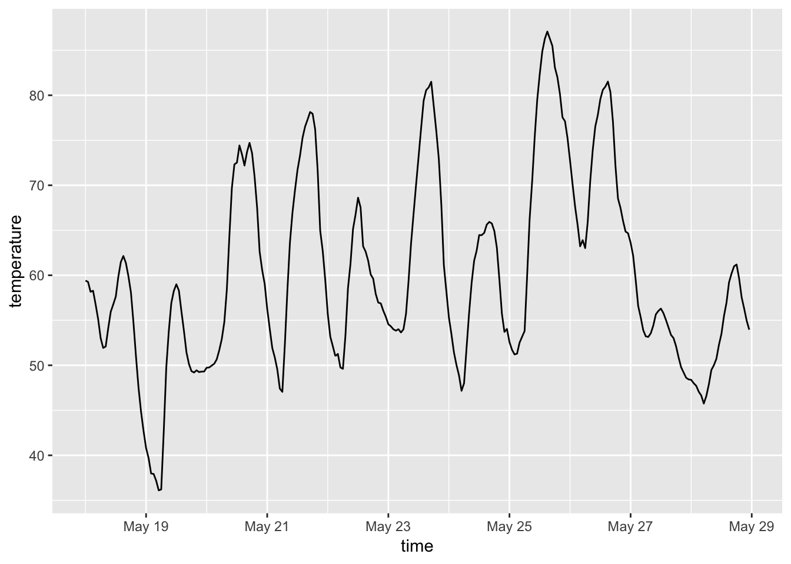
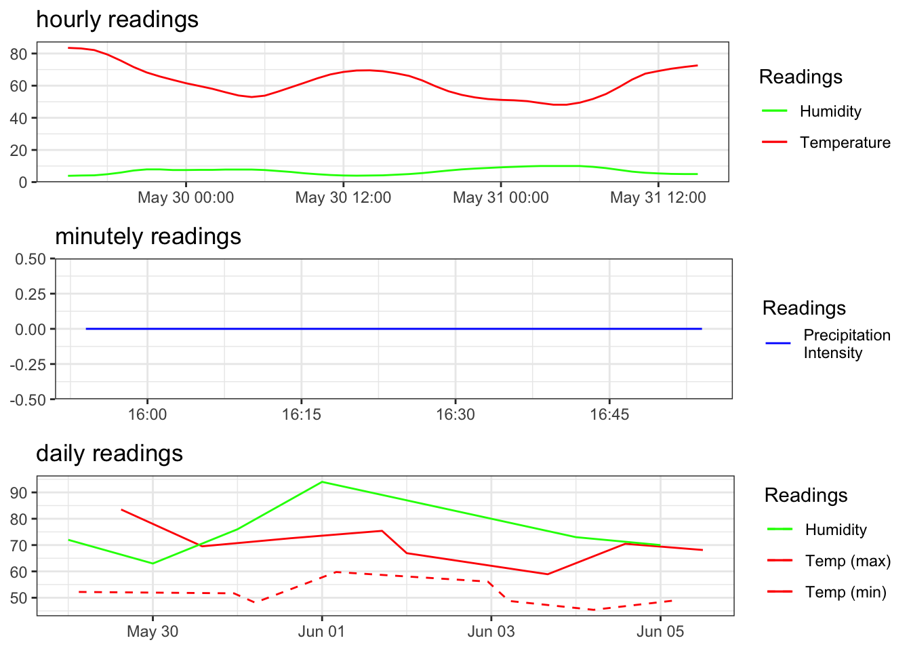

<!-- [](http://www.repostatus.org/#active)  -->

<!-- [](https://codecov.io/github/hrbrmstr/darksky?branch=master) -->

<!-- [](https://travis-ci.org/hrbrmstr/darksky) -->

<!-- [](https://ci.appveyor.com/project/hrbrmstr/darksky) -->

<!-- [](https://cran.r-project.org/package=darksky) -->

<!--  -->

`darksky` : Tools to Work with the Dark Sky API

  - Dark Sky API Docs: <https://darksky.net/dev/docs>
  - Dark Sky Dev site: <https://darksky.net/dev/>

The following functions are implemented:

  - `darksky_api_key` : Get or set `DARKSKY_API_KEY` value
  - `get_current_forecast` : Retrieve the current forecast (for the next
    week)
  - `get_forecast_for` : Retrieve weather data for a specific place/time
  - `plot.darksky` : Plot method for `darksky` objects
  - `print.darksky` : A tad more human readable default printing

### Installation

``` r
devtools::install_github("hrbrmstr/darksky")
```

OR

``` r
devtools::install.packages("darksky")
```

### Usage

``` r
library(darksky)
library(tidyverse)

# current version
packageVersion("darksky")
```

    ## [1] '1.3.0'

``` r
now <- get_current_forecast(43.2672, -70.8617)
print(now)
```

    ## minutely 
    ## ======================================================================================================================== 
    ## 'data.frame':    61 obs. of  3 variables:
    ##  $ time             : POSIXct, format: "2018-05-29 15:54:00" "2018-05-29 15:55:00" "2018-05-29 15:56:00" "2018-05-29 15:57:00" ...
    ##  $ precipIntensity  : int  0 0 0 0 0 0 0 0 0 0 ...
    ##  $ precipProbability: int  0 0 0 0 0 0 0 0 0 0 ...
    ## NULL
    ## 
    ## hourly 
    ## ======================================================================================================================== 
    ## 'data.frame':    49 obs. of  18 variables:
    ##  $ time               : POSIXct, format: "2018-05-29 15:00:00" "2018-05-29 16:00:00" "2018-05-29 17:00:00" "2018-05-29 18:00:00" ...
    ##  $ summary            : chr  "Clear" "Clear" "Clear" "Clear" ...
    ##  $ icon               : chr  "clear-day" "clear-day" "clear-day" "clear-day" ...
    ##  $ precipIntensity    : num  0 0 0.001 0.0018 0 0.0013 0.0012 0 0.0004 0 ...
    ##  $ precipProbability  : num  0 0 0.01 0.02 0 0.03 0.03 0 0.02 0 ...
    ##  $ temperature        : num  83.5 83.2 82.1 79.4 75.7 ...
    ##  $ apparentTemperature: num  83.5 83.2 82.1 79.4 75.7 ...
    ##  $ dewPoint           : num  55.9 56.8 57 58.5 60.4 ...
    ##  $ humidity           : num  0.39 0.41 0.42 0.49 0.59 0.72 0.79 0.79 0.75 0.75 ...
    ##  $ pressure           : num  1014 1014 1014 1015 1016 ...
    ##  $ windSpeed          : num  0.35 2.73 2.42 2.1 2.15 2.32 2.79 3.05 3.84 4.21 ...
    ##  $ windGust           : num  7.3 6.84 5.68 5.74 5.81 ...
    ##  $ windBearing        : int  140 136 132 121 131 150 82 65 53 55 ...
    ##  $ cloudCover         : num  0.03 0.01 0.03 0.03 0.04 0.04 0.07 0.1 0.12 0.15 ...
    ##  $ uvIndex            : int  5 3 2 1 0 0 0 0 0 0 ...
    ##  $ visibility         : num  8.96 7.3 10 10 10 10 10 10 10 10 ...
    ##  $ ozone              : num  343 343 343 342 342 ...
    ##  $ precipType         : chr  NA NA "rain" "rain" ...
    ## NULL
    ## 
    ## daily 
    ## ======================================================================================================================== 
    ## 'data.frame':    8 obs. of  39 variables:
    ##  $ time                       : POSIXct, format: "2018-05-29" "2018-05-30" "2018-05-31" "2018-06-01" ...
    ##  $ summary                    : chr  "Mostly cloudy in the morning." "Partly cloudy throughout the day." "Foggy overnight." "Foggy in the morning." ...
    ##  $ icon                       : chr  "partly-cloudy-day" "partly-cloudy-day" "fog" "fog" ...
    ##  $ sunriseTime                : POSIXct, format: "2018-05-29 05:09:10" "2018-05-30 05:08:36" "2018-05-31 05:08:03" "2018-06-01 05:07:33" ...
    ##  $ sunsetTime                 : POSIXct, format: "2018-05-29 20:15:37" "2018-05-30 20:16:28" "2018-05-31 20:17:18" "2018-06-01 20:18:07" ...
    ##  $ moonPhase                  : num  0.51 0.54 0.57 0.6 0.63 0.66 0.69 0.72
    ##  $ precipIntensity            : num  0.0003 0.0003 0.0004 0.0041 0.0067 0.0258 0.0006 0.0131
    ##  $ precipIntensityMax         : num  0.0018 0.0014 0.003 0.0101 0.0199 0.0608 0.0046 0.0285
    ##  $ precipIntensityMaxTime     : POSIXct, format: "2018-05-29 18:00:00" "2018-05-30 01:00:00" "2018-05-31 20:00:00" "2018-06-01 15:00:00" ...
    ##  $ precipProbability          : num  0.14 0.12 0.13 0.35 0.49 0.71 0.21 0.49
    ##  $ precipType                 : chr  "rain" "rain" "rain" "rain" ...
    ##  $ temperatureHigh            : num  83.5 69.5 72.6 75.4 66 ...
    ##  $ temperatureHighTime        : int  1527620400 1527703200 1527793200 1527886800 1527966000 1528056000 1528135200 1528214400
    ##  $ temperatureLow             : num  52.9 48.1 59.8 60.2 48.8 ...
    ##  $ temperatureLowTime         : int  1527670800 1527757200 1527840000 1527940800 1528016400 1528102800 1528185600 1528272000
    ##  $ apparentTemperatureHigh    : num  83.5 69.5 72.6 76.4 66 ...
    ##  $ apparentTemperatureHighTime: int  1527620400 1527703200 1527793200 1527886800 1527966000 1528056000 1528135200 1528214400
    ##  $ apparentTemperatureLow     : num  52.9 46.8 60.1 60.2 45.9 ...
    ##  $ apparentTemperatureLowTime : int  1527670800 1527757200 1527840000 1527940800 1528016400 1528102800 1528185600 1528272000
    ##  $ dewPoint                   : num  57 47.1 52.2 65 58.1 ...
    ##  $ humidity                   : num  0.72 0.63 0.76 0.94 0.87 0.8 0.73 0.7
    ##  $ pressure                   : num  1014 1023 1017 1007 1007 ...
    ##  $ windSpeed                  : num  0.6 4.31 5.86 4.39 5.47 7.34 3.67 7.29
    ##  $ windGust                   : num  11.3 17.1 16.9 13.6 28.4 ...
    ##  $ windGustTime               : int  1527649200 1527674400 1527782400 1527829200 1527933600 1528005600 1528138800 1528239600
    ##  $ windBearing                : int  259 105 181 172 59 62 0 346
    ##  $ cloudCover                 : num  0.25 0.48 0.73 0.81 1 0.38 0.85 1
    ##  $ uvIndex                    : int  8 6 7 6 5 8 6 6
    ##  $ uvIndexTime                : int  1527609600 1527696000 1527782400 1527868800 1527955200 1528041600 1528131600 1528218000
    ##  $ visibility                 : num  9.52 10 9.42 10 NA NA NA NA
    ##  $ ozone                      : num  342 327 316 311 312 ...
    ##  $ temperatureMin             : num  52.2 51.7 48.1 59.8 56.1 ...
    ##  $ temperatureMinTime         : POSIXct, format: "2018-05-29 03:00:00" "2018-05-30 23:00:00" "2018-05-31 05:00:00" "2018-06-01 04:00:00" ...
    ##  $ temperatureMax             : num  83.5 69.5 72.6 75.4 66.9 ...
    ##  $ temperatureMaxTime         : POSIXct, format: "2018-05-29 15:00:00" "2018-05-30 14:00:00" "2018-05-31 15:00:00" "2018-06-01 17:00:00" ...
    ##  $ apparentTemperatureMin     : num  52.2 51.7 46.8 60.1 56.1 ...
    ##  $ apparentTemperatureMinTime : POSIXct, format: "2018-05-29 03:00:00" "2018-05-30 23:00:00" "2018-05-31 05:00:00" "2018-06-01 04:00:00" ...
    ##  $ apparentTemperatureMax     : num  83.5 69.5 72.6 76.4 67.8 ...
    ##  $ apparentTemperatureMaxTime : POSIXct, format: "2018-05-29 15:00:00" "2018-05-30 14:00:00" "2018-05-31 15:00:00" "2018-06-01 17:00:00" ...
    ## NULL
    ## 
    ## currently 
    ## ======================================================================================================================== 
    ## 'data.frame':    1 obs. of  19 variables:
    ##  $ time                : POSIXct, format: "2018-05-29 15:54:44"
    ##  $ summary             : chr "Clear"
    ##  $ icon                : chr "clear-day"
    ##  $ nearestStormDistance: int 119
    ##  $ nearestStormBearing : int 234
    ##  $ precipIntensity     : int 0
    ##  $ precipProbability   : int 0
    ##  $ temperature         : num 83.2
    ##  $ apparentTemperature : num 83.2
    ##  $ dewPoint            : num 56.8
    ##  $ humidity            : num 0.41
    ##  $ pressure            : num 1014
    ##  $ windSpeed           : num 2.52
    ##  $ windGust            : num 6.88
    ##  $ windBearing         : int 137
    ##  $ cloudCover          : num 0.02
    ##  $ uvIndex             : int 3
    ##  $ visibility          : num 7.44
    ##  $ ozone               : num 343
    ## NULL

Historical (using `Date` objects):

``` r
seq(Sys.Date()-10, Sys.Date(), "1 day") %>% 
  map(~get_forecast_for(43.2672, -70.8617, .x)) %>% 
  map_df("hourly") %>% 
  ggplot(aes(x=time, y=temperature)) +
  geom_line()
```



``` r
then <- get_forecast_for(43.2672, -70.8617, "2013-05-06T12:00:00-0400", add_headers=TRUE)
print(then)
```

    ## hourly 
    ## ======================================================================================================================== 
    ## 'data.frame':    24 obs. of  14 variables:
    ##  $ time               : POSIXct, format: "2013-05-06 00:00:00" "2013-05-06 01:00:00" "2013-05-06 02:00:00" "2013-05-06 03:00:00" ...
    ##  $ summary            : chr  "Clear" "Clear" "Clear" "Clear" ...
    ##  $ icon               : chr  "clear-night" "clear-night" "clear-night" "clear-night" ...
    ##  $ precipIntensity    : int  0 0 0 0 0 0 0 0 0 0 ...
    ##  $ precipProbability  : int  0 0 0 0 0 0 0 0 0 0 ...
    ##  $ temperature        : num  40.3 38.8 37.6 36.1 34.4 ...
    ##  $ apparentTemperature: num  38.4 38.8 37.6 36.1 34.4 ...
    ##  $ dewPoint           : num  36.5 35.6 35.2 34.2 32.7 ...
    ##  $ humidity           : num  0.86 0.88 0.91 0.92 0.93 0.95 0.94 0.92 0.85 0.81 ...
    ##  $ pressure           : num  1025 1025 1024 1024 1024 ...
    ##  $ windSpeed          : num  3.28 2.31 2.36 1.19 2.2 2.86 1.95 2.16 4.16 5.3 ...
    ##  $ windBearing        : int  197 186 193 250 285 247 301 233 197 172 ...
    ##  $ cloudCover         : num  0 0 0 0 0 0.02 0.03 0.2 0.23 0.02 ...
    ##  $ visibility         : num  9.36 8.18 8.49 7.98 6.89 6.71 6.08 7.56 7.89 9.28 ...
    ## NULL
    ## 
    ## daily 
    ## ======================================================================================================================== 
    ## 'data.frame':    1 obs. of  32 variables:
    ##  $ time                       : POSIXct, format: "2013-05-06"
    ##  $ summary                    : chr "Foggy overnight."
    ##  $ icon                       : chr "fog"
    ##  $ sunriseTime                : POSIXct, format: "2013-05-06 05:30:40"
    ##  $ sunsetTime                 : POSIXct, format: "2013-05-06 19:51:57"
    ##  $ moonPhase                  : num 0.9
    ##  $ precipIntensity            : int 0
    ##  $ precipIntensityMax         : int 0
    ##  $ precipProbability          : int 0
    ##  $ temperatureHigh            : num 60.3
    ##  $ temperatureHighTime        : int 1367863200
    ##  $ temperatureLow             : num 43.4
    ##  $ temperatureLowTime         : int 1367920800
    ##  $ apparentTemperatureHigh    : num 60.3
    ##  $ apparentTemperatureHighTime: int 1367863200
    ##  $ apparentTemperatureLow     : num 43.2
    ##  $ apparentTemperatureLowTime : int 1367899200
    ##  $ dewPoint                   : num 40.2
    ##  $ humidity                   : num 0.78
    ##  $ pressure                   : num 1023
    ##  $ windSpeed                  : num 4.01
    ##  $ windBearing                : int 161
    ##  $ cloudCover                 : num 0.05
    ##  $ visibility                 : num 7.8
    ##  $ temperatureMin             : num 34.3
    ##  $ temperatureMinTime         : POSIXct, format: "2013-05-06 05:00:00"
    ##  $ temperatureMax             : num 60.3
    ##  $ temperatureMaxTime         : POSIXct, format: "2013-05-06 14:00:00"
    ##  $ apparentTemperatureMin     : num 34.3
    ##  $ apparentTemperatureMinTime : POSIXct, format: "2013-05-06 05:00:00"
    ##  $ apparentTemperatureMax     : num 60.3
    ##  $ apparentTemperatureMaxTime : POSIXct, format: "2013-05-06 14:00:00"
    ## NULL
    ## 
    ## currently 
    ## ======================================================================================================================== 
    ## 'data.frame':    1 obs. of  14 variables:
    ##  $ time               : POSIXct, format: "2013-05-06 12:00:00"
    ##  $ summary            : chr "Clear"
    ##  $ icon               : chr "clear-day"
    ##  $ precipIntensity    : int 0
    ##  $ precipProbability  : int 0
    ##  $ temperature        : num 58.1
    ##  $ apparentTemperature: num 58.1
    ##  $ dewPoint           : num 41.9
    ##  $ humidity           : num 0.55
    ##  $ pressure           : num 1024
    ##  $ windSpeed          : num 5.58
    ##  $ windBearing        : int 147
    ##  $ cloudCover         : num 0.04
    ##  $ visibility         : num 9.47
    ## NULL

``` r
# getting data for more than one location

more_than_one <- data.frame(loc=c("Maine", "Seattle"),
                            lat=c(43.2672, 47.6097),
                            lon=c(70.8617, 122.3331),
                            when=c("2013-05-06T12:00:00-0400",
                                   "2013-05-06T12:00:00-0400"),
                            stringsAsFactors=FALSE)

bigger_list <- pmap(list(more_than_one$lat, more_than_one$lon,
                         more_than_one$when),
                    get_forecast_for)
names(bigger_list) <- more_than_one$loc

bigger_list$Seattle
```

    ## hourly 
    ## ======================================================================================================================== 
    ## 'data.frame':    24 obs. of  13 variables:
    ##  $ time               : POSIXct, format: "2013-05-06 12:00:00" "2013-05-06 13:00:00" "2013-05-06 14:00:00" "2013-05-06 15:00:00" ...
    ##  $ summary            : chr  "Mostly Cloudy" "Partly Cloudy" "Partly Cloudy" "Partly Cloudy" ...
    ##  $ icon               : chr  "partly-cloudy-night" "partly-cloudy-night" "partly-cloudy-night" "partly-cloudy-night" ...
    ##  $ precipType         : chr  "rain" "rain" "rain" "rain" ...
    ##  $ temperature        : num  57.4 55.8 54.5 53.3 52.4 ...
    ##  $ apparentTemperature: num  57.4 55.8 54.5 53.3 52.4 ...
    ##  $ dewPoint           : num  37 37.9 38.5 38.5 38.4 ...
    ##  $ humidity           : num  0.46 0.51 0.54 0.57 0.59 0.58 0.53 0.46 0.39 0.33 ...
    ##  $ pressure           : num  1014 1013 1013 1013 1013 ...
    ##  $ windSpeed          : num  3.84 4.39 4.78 4.61 4.28 4.45 5.59 7.2 8.45 8.99 ...
    ##  $ windBearing        : int  182 176 174 176 181 186 188 189 190 193 ...
    ##  $ cloudCover         : num  0.62 0.41 0.29 0.4 0.61 0.75 0.73 0.63 0.56 0.58 ...
    ##  $ visibility         : num  9.65 9.42 9.25 9.21 9.23 9.25 9.24 9.23 9.25 9.3 ...
    ## NULL
    ## 
    ## daily 
    ## ======================================================================================================================== 
    ## 'data.frame':    1 obs. of  30 variables:
    ##  $ time                       : POSIXct, format: "2013-05-06 12:00:00"
    ##  $ summary                    : chr "Mostly cloudy throughout the day."
    ##  $ icon                       : chr "partly-cloudy-day"
    ##  $ sunriseTime                : POSIXct, format: "2013-05-06 16:25:32"
    ##  $ sunsetTime                 : POSIXct, format: "2013-05-07 07:11:30"
    ##  $ moonPhase                  : num 0.91
    ##  $ precipType                 : chr "rain"
    ##  $ temperatureHigh            : num 84.5
    ##  $ temperatureHighTime        : int 1367913600
    ##  $ temperatureLow             : num 59.2
    ##  $ temperatureLowTime         : int 1367956800
    ##  $ apparentTemperatureHigh    : num 84.5
    ##  $ apparentTemperatureHighTime: int 1367913600
    ##  $ apparentTemperatureLow     : num 59.2
    ##  $ apparentTemperatureLowTime : int 1367956800
    ##  $ dewPoint                   : num 37.3
    ##  $ humidity                   : num 0.35
    ##  $ pressure                   : num 1009
    ##  $ windSpeed                  : num 6.5
    ##  $ windBearing                : int 192
    ##  $ cloudCover                 : num 0.62
    ##  $ visibility                 : num 9.36
    ##  $ temperatureMin             : num 52.4
    ##  $ temperatureMinTime         : POSIXct, format: "2013-05-06 16:00:00"
    ##  $ temperatureMax             : num 84.5
    ##  $ temperatureMaxTime         : POSIXct, format: "2013-05-07 04:00:00"
    ##  $ apparentTemperatureMin     : num 52.4
    ##  $ apparentTemperatureMinTime : POSIXct, format: "2013-05-06 16:00:00"
    ##  $ apparentTemperatureMax     : num 84.5
    ##  $ apparentTemperatureMaxTime : POSIXct, format: "2013-05-07 04:00:00"
    ## NULL
    ## 
    ## currently 
    ## ======================================================================================================================== 
    ## 'data.frame':    1 obs. of  13 variables:
    ##  $ time               : POSIXct, format: "2013-05-06 12:00:00"
    ##  $ summary            : chr "Mostly Cloudy"
    ##  $ icon               : chr "partly-cloudy-night"
    ##  $ precipType         : chr "rain"
    ##  $ temperature        : num 57.4
    ##  $ apparentTemperature: num 57.4
    ##  $ dewPoint           : num 37
    ##  $ humidity           : num 0.46
    ##  $ pressure           : num 1014
    ##  $ windSpeed          : num 3.84
    ##  $ windBearing        : int 182
    ##  $ cloudCover         : num 0.62
    ##  $ visibility         : num 9.65
    ## NULL

``` r
bigger_list$Maine
```

    ## hourly 
    ## ======================================================================================================================== 
    ## 'data.frame':    24 obs. of  13 variables:
    ##  $ time               : POSIXct, format: "2013-05-05 14:00:00" "2013-05-05 15:00:00" "2013-05-05 16:00:00" "2013-05-05 17:00:00" ...
    ##  $ summary            : chr  "Clear" "Clear" "Clear" "Clear" ...
    ##  $ icon               : chr  "clear-night" "clear-night" "clear-night" "clear-night" ...
    ##  $ precipType         : chr  "rain" "rain" "rain" "rain" ...
    ##  $ temperature        : num  53.5 52.4 51.2 49.3 51 ...
    ##  $ apparentTemperature: num  53.5 52.4 51.2 49.3 51 ...
    ##  $ dewPoint           : num  36.7 36.5 40.4 37.6 38 ...
    ##  $ humidity           : num  0.53 0.55 0.66 0.64 0.61 0.63 0.62 0.59 0.47 0.45 ...
    ##  $ pressure           : num  1020 NA NA 1020 NA ...
    ##  $ windSpeed          : num  4.72 3.32 13 1.86 2.05 3.49 1.91 3.97 13 2.65 ...
    ##  $ windBearing        : int  49 48 70 96 101 134 133 177 60 51 ...
    ##  $ cloudCover         : num  0 0 0 0 0 0 0.15 0 0 0 ...
    ##  $ visibility         : num  7.62 6.2 6.2 7.62 6.2 6.2 9.15 6.2 6.2 9.15 ...
    ## NULL
    ## 
    ## daily 
    ## ======================================================================================================================== 
    ## 'data.frame':    1 obs. of  30 variables:
    ##  $ time                       : POSIXct, format: "2013-05-05 14:00:00"
    ##  $ summary                    : chr "Clear throughout the day."
    ##  $ icon                       : chr "clear-day"
    ##  $ sunriseTime                : POSIXct, format: "2013-05-05 20:04:18"
    ##  $ sunsetTime                 : POSIXct, format: "2013-05-06 10:24:35"
    ##  $ moonPhase                  : num 0.88
    ##  $ precipType                 : chr "rain"
    ##  $ temperatureHigh            : num 75.3
    ##  $ temperatureHighTime        : int 1367827200
    ##  $ temperatureLow             : num 47.6
    ##  $ temperatureLowTime         : int 1367881200
    ##  $ apparentTemperatureHigh    : num 75.3
    ##  $ apparentTemperatureHighTime: int 1367827200
    ##  $ apparentTemperatureLow     : num 45.4
    ##  $ apparentTemperatureLowTime : int 1367881200
    ##  $ dewPoint                   : num 37.6
    ##  $ humidity                   : num 0.42
    ##  $ pressure                   : num 1018
    ##  $ windSpeed                  : num 8.31
    ##  $ windBearing                : int 62
    ##  $ cloudCover                 : num 0.02
    ##  $ visibility                 : num 7.02
    ##  $ temperatureMin             : num 49.3
    ##  $ temperatureMinTime         : POSIXct, format: "2013-05-05 17:00:00"
    ##  $ temperatureMax             : num 75.3
    ##  $ temperatureMaxTime         : POSIXct, format: "2013-05-06 04:00:00"
    ##  $ apparentTemperatureMin     : num 49.3
    ##  $ apparentTemperatureMinTime : POSIXct, format: "2013-05-05 17:00:00"
    ##  $ apparentTemperatureMax     : num 75.3
    ##  $ apparentTemperatureMaxTime : POSIXct, format: "2013-05-06 04:00:00"
    ## NULL
    ## 
    ## currently 
    ## ======================================================================================================================== 
    ## 'data.frame':    1 obs. of  12 variables:
    ##  $ time               : POSIXct, format: "2013-05-06 12:00:00"
    ##  $ summary            : chr "Clear"
    ##  $ icon               : chr "clear-night"
    ##  $ precipType         : chr "rain"
    ##  $ temperature        : num 67.2
    ##  $ apparentTemperature: num 67.2
    ##  $ dewPoint           : num 33.2
    ##  $ humidity           : num 0.28
    ##  $ windSpeed          : num 11.2
    ##  $ windBearing        : int 72
    ##  $ cloudCover         : int 0
    ##  $ visibility         : num 6.2
    ## NULL

``` r
print(sprintf("You have used %s API calls.", then$`x-forecast-api-calls`))
```

    ## [1] "You have used 32 API calls."

``` r
plot(now)
```



### Test Results

``` r
library(darksky)
library(testthat)

date()
```

    ## [1] "Tue May 29 15:54:49 2018"

``` r
test_dir("tests/")
```

    ## ✔ | OK F W S | Context
    ## ══ testthat results  ════════════════════════════════════════════════════════════
    ## OK: 4 SKIPPED: 0 FAILED: 0
    ## 
    ## ══ Results ══════════════════════════════════════════════════════════════════════
    ## Duration: 0.5 s
    ## 
    ## OK:       0
    ## Failed:   0
    ## Warnings: 0
    ## Skipped:  0
