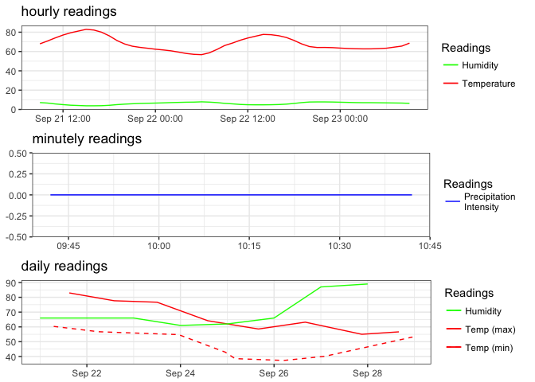

[](https://travis-ci.org/hrbrmstr/darksky)

`darksky` : Tools to Work with the Dark Sky API

-   Dark Sky API Docs: <https://darksky.net/dev/docs>
-   Dark Sky Dev site: <https://darksky.net/dev/>

The following functions are implemented:

-   `darksky_api_key` : Get or set `DARKSKY_API_KEY` value
-   `get_current_forecast` : Retrieve the current forecast (for the next week)
-   `get_forecast_for` : Retrieve weather data for a specific place/time
-   `plot.darksky` : Plot method for `darksky` objects
-   `print.darksky` : A tad more human readable default printing

### Installation

``` r
devtools::install_github("hrbrmstr/darksky")
```

### Usage

``` r
library(darksky)
library(purrr)

# current verison
packageVersion("darksky")
```

    ## [1] '1.0.0'

``` r
now <- get_current_forecast(43.2672, -70.8617)
print(now)
```

    ## minutely 
    ## ======================================================================================================================== 
    ## Observations: 61
    ## Variables: 3
    ## $ time              <dttm> 2016-09-21 09:42:00, 2016-09-21 09:43:00, 2016-09-21 09:44:00, 2016-09-21 09:45:00, 2016...
    ## $ precipIntensity   <int> 0, 0, 0, 0, 0, 0, 0, 0, 0, 0, 0, 0, 0, 0, 0, 0, 0, 0, 0, 0, 0, 0, 0, 0, 0, 0, 0, 0, 0, 0,...
    ## $ precipProbability <int> 0, 0, 0, 0, 0, 0, 0, 0, 0, 0, 0, 0, 0, 0, 0, 0, 0, 0, 0, 0, 0, 0, 0, 0, 0, 0, 0, 0, 0, 0,...
    ## 
    ## hourly 
    ## ======================================================================================================================== 
    ## Observations: 49
    ## Variables: 16
    ## $ time                <dttm> 2016-09-21 09:00:00, 2016-09-21 10:00:00, 2016-09-21 11:00:00, 2016-09-21 12:00:00, 20...
    ## $ summary             <chr> "Clear", "Clear", "Clear", "Clear", "Clear", "Clear", "Clear", "Clear", "Clear", "Clear...
    ## $ icon                <chr> "clear-day", "clear-day", "clear-day", "clear-day", "clear-day", "clear-day", "clear-da...
    ## $ precipIntensity     <dbl> 0, 0, 0, 0, 0, 0, 0, 0, 0, 0, 0, 0, 0, 0, 0, 0, 0, 0, 0, 0, 0, 0, 0, 0, 0, 0, 0, 0, 0, ...
    ## $ precipProbability   <dbl> 0, 0, 0, 0, 0, 0, 0, 0, 0, 0, 0, 0, 0, 0, 0, 0, 0, 0, 0, 0, 0, 0, 0, 0, 0, 0, 0, 0, 0, ...
    ## $ temperature         <dbl> 67.95, 70.92, 74.12, 77.05, 79.42, 81.18, 82.97, 82.24, 80.00, 76.24, 71.42, 67.80, 65....
    ## $ apparentTemperature <dbl> 67.95, 70.92, 74.12, 77.05, 79.42, 80.86, 82.11, 81.43, 79.86, 76.24, 71.42, 67.80, 65....
    ## $ dewPoint            <dbl> 58.24, 58.80, 57.98, 56.86, 55.81, 55.05, 55.05, 54.07, 52.83, 51.97, 51.69, 51.24, 50....
    ## $ humidity            <dbl> 0.71, 0.66, 0.57, 0.50, 0.44, 0.41, 0.38, 0.38, 0.39, 0.43, 0.50, 0.55, 0.59, 0.62, 0.6...
    ## $ windSpeed           <dbl> 7.88, 6.81, 6.33, 5.52, 5.29, 5.36, 5.46, 5.62, 5.39, 4.33, 3.49, 3.38, 3.79, 4.18, 4.4...
    ## $ windBearing         <int> 308, 306, 303, 299, 289, 279, 268, 265, 266, 263, 259, 256, 259, 263, 269, 275, 279, 28...
    ## $ visibility          <dbl> 9.90, 9.96, 10.00, 10.00, 10.00, 10.00, 10.00, 10.00, 10.00, 10.00, 10.00, 10.00, 10.00...
    ## $ cloudCover          <dbl> 0.09, 0.15, 0.20, 0.22, 0.18, 0.11, 0.07, 0.07, 0.06, 0.04, 0.04, 0.05, 0.11, 0.17, 0.2...
    ## $ pressure            <dbl> 1020.18, 1020.32, 1020.35, 1020.21, 1019.96, 1019.74, 1019.55, 1019.40, 1019.40, 1019.6...
    ## $ ozone               <dbl> 268.89, 268.71, 268.54, 268.48, 268.42, 268.21, 267.76, 267.15, 266.60, 266.18, 265.81,...
    ## $ precipType          <chr> NA, NA, NA, NA, NA, NA, NA, NA, NA, NA, NA, NA, NA, NA, NA, NA, NA, NA, NA, NA, NA, NA,...
    ## 
    ## daily 
    ## ======================================================================================================================== 
    ## Observations: 8
    ## Variables: 27
    ## $ time                       <dttm> 2016-09-21, 2016-09-22, 2016-09-23, 2016-09-24, 2016-09-25, 2016-09-26, 2016-09...
    ## $ summary                    <chr> "Clear throughout the day.", "Partly cloudy overnight.", "Light rain starting in...
    ## $ icon                       <chr> "clear-day", "partly-cloudy-night", "rain", "clear-day", "clear-day", "partly-cl...
    ## $ sunriseTime                <dttm> 2016-09-21 06:31:22, 2016-09-22 06:32:28, 2016-09-23 06:33:34, 2016-09-24 06:34...
    ## $ sunsetTime                 <dttm> 2016-09-21 18:43:59, 2016-09-22 18:42:09, 2016-09-23 18:40:19, 2016-09-24 18:38...
    ## $ moonPhase                  <dbl> 0.68, 0.72, 0.75, 0.79, 0.83, 0.86, 0.90, 0.93
    ## $ precipIntensity            <dbl> 0.0000, 0.0000, 0.0027, 0.0000, 0.0000, 0.0000, 0.0143, 0.0138
    ## $ precipIntensityMax         <dbl> 0.0000, 0.0000, 0.0147, 0.0000, 0.0000, 0.0000, 0.0371, 0.0388
    ## $ precipProbability          <dbl> 0.00, 0.00, 0.45, 0.00, 0.00, 0.00, 0.54, 0.55
    ## $ temperatureMin             <dbl> 60.34, 56.74, 54.80, 42.92, 38.56, 37.33, 40.13, 53.14
    ## $ temperatureMinTime         <dttm> 2016-09-21 07:00:00, 2016-09-22 06:00:00, 2016-09-23 23:00:00, 2016-09-24 23:00...
    ## $ temperatureMax             <dbl> 82.97, 77.68, 76.68, 64.18, 58.58, 63.20, 55.01, 56.65
    ## $ temperatureMaxTime         <dttm> 2016-09-21 15:00:00, 2016-09-22 14:00:00, 2016-09-23 12:00:00, 2016-09-24 14:00...
    ## $ apparentTemperatureMin     <dbl> 60.34, 56.74, 54.80, 40.24, 34.30, 33.78, 40.13, 53.14
    ## $ apparentTemperatureMinTime <dttm> 2016-09-21 07:00:00, 2016-09-22 06:00:00, 2016-09-23 23:00:00, 2016-09-24 23:00...
    ## $ apparentTemperatureMax     <dbl> 82.11, 77.68, 76.68, 64.18, 58.58, 63.20, 55.01, 56.65
    ## $ apparentTemperatureMaxTime <dttm> 2016-09-21 15:00:00, 2016-09-22 14:00:00, 2016-09-23 12:00:00, 2016-09-24 14:00...
    ## $ dewPoint                   <dbl> 55.99, 54.08, 54.32, 38.89, 33.29, 36.45, 44.02, 51.41
    ## $ humidity                   <dbl> 0.66, 0.66, 0.66, 0.61, 0.62, 0.66, 0.87, 0.89
    ## $ windSpeed                  <dbl> 4.50, 1.44, 4.07, 6.83, 7.01, 2.88, 4.35, 8.62
    ## $ windBearing                <int> 279, 166, 247, 308, 312, 277, 7, 59
    ## $ visibility                 <dbl> 9.87, 10.00, 10.00, 10.00, NA, NA, NA, NA
    ## $ cloudCover                 <dbl> 0.11, 0.07, 0.49, 0.06, 0.00, 0.05, 0.92, 1.00
    ## $ pressure                   <dbl> 1019.58, 1020.49, 1015.55, 1018.06, 1019.44, 1019.53, 1019.43, 1024.68
    ## $ ozone                      <dbl> 267.11, 259.91, 267.42, 306.79, 314.66, 298.59, 289.30, 291.89
    ## $ precipIntensityMaxTime     <dttm> NA, NA, 2016-09-23 20:00:00, NA, NA, NA, 2016-09-27 23:00:00, 2016-09-28 01:00:00
    ## $ precipType                 <chr> NA, NA, "rain", NA, NA, NA, "rain", "rain"
    ## 
    ## currently 
    ## ======================================================================================================================== 
    ## Observations: 1
    ## Variables: 17
    ## $ time                 <dttm> 2016-09-21 09:42:30
    ## $ summary              <chr> "Clear"
    ## $ icon                 <chr> "clear-day"
    ## $ nearestStormDistance <int> 109
    ## $ nearestStormBearing  <int> 204
    ## $ precipIntensity      <int> 0
    ## $ precipProbability    <int> 0
    ## $ temperature          <dbl> 70.06
    ## $ apparentTemperature  <dbl> 70.06
    ## $ dewPoint             <dbl> 58.66
    ## $ humidity             <dbl> 0.67
    ## $ windSpeed            <dbl> 7.12
    ## $ windBearing          <int> 307
    ## $ visibility           <dbl> 9.94
    ## $ cloudCover           <dbl> 0.13
    ## $ pressure             <dbl> 1020.28
    ## $ ozone                <dbl> 268.76

``` r
then <- get_forecast_for(43.2672, -70.8617, "2013-05-06T12:00:00-0400", add_headers=TRUE)
print(then)
```

    ## hourly 
    ## ======================================================================================================================== 
    ## Observations: 24
    ## Variables: 14
    ## $ time                <dttm> 2013-05-06 00:00:00, 2013-05-06 01:00:00, 2013-05-06 02:00:00, 2013-05-06 03:00:00, 20...
    ## $ summary             <chr> "Clear", "Clear", "Clear", "Clear", "Clear", "Clear", "Clear", "Partly Cloudy", "Partly...
    ## $ icon                <chr> "clear-night", "clear-night", "clear-night", "clear-night", "clear-night", "clear-night...
    ## $ precipIntensity     <int> 0, 0, 0, 0, 0, 0, 0, 0, 0, 0, 0, 0, 0, 0, 0, 0, 0, 0, 0, 0, 0, 0, 0, 0
    ## $ precipProbability   <int> 0, 0, 0, 0, 0, 0, 0, 0, 0, 0, 0, 0, 0, 0, 0, 0, 0, 0, 0, 0, 0, 0, 0, 0
    ## $ temperature         <dbl> 38.85, 37.09, 35.98, 34.41, 32.17, 32.31, 32.31, 38.90, 43.85, 48.67, 52.36, 56.46, 60....
    ## $ apparentTemperature <dbl> 37.07, 37.09, 35.98, 34.41, 32.17, 32.31, 29.67, 38.90, 41.82, 46.09, 52.36, 56.46, 60....
    ## $ dewPoint            <dbl> 34.70, 33.68, 33.52, 32.31, 30.45, 30.59, 30.41, 36.43, 38.67, 41.70, 43.14, 41.86, 41....
    ## $ humidity            <dbl> 0.85, 0.87, 0.91, 0.92, 0.93, 0.93, 0.93, 0.91, 0.82, 0.77, 0.71, 0.58, 0.50, 0.47, 0.4...
    ## $ windSpeed           <dbl> 3.00, NA, NA, NA, 2.94, NA, 3.00, NA, 3.94, 5.98, 5.52, 5.82, 6.03, 8.81, 9.40, 9.17, 7...
    ## $ windBearing         <int> 210, NA, NA, NA, 304, NA, 330, NA, 184, 166, 160, 173, 127, 101, 108, 141, 142, 127, 14...
    ## $ visibility          <dbl> 9.84, 8.23, 8.76, 8.46, 7.03, 6.77, 5.85, 8.40, 8.46, 10.00, 10.00, 10.00, 10.00, 10.00...
    ## $ cloudCover          <dbl> 0.00, 0.00, 0.00, 0.00, 0.00, 0.00, 0.00, 0.59, 0.25, 0.16, 0.05, 0.05, 0.05, 0.05, 0.0...
    ## $ pressure            <dbl> 1024.98, 1024.88, 1024.66, 1024.38, 1024.04, 1024.10, 1024.40, 1024.92, 1025.14, 1025.3...
    ## 
    ## daily 
    ## ======================================================================================================================== 
    ## Observations: 1
    ## Variables: 24
    ## $ time                       <dttm> 2013-05-06
    ## $ summary                    <chr> "Foggy overnight."
    ## $ icon                       <chr> "fog"
    ## $ sunriseTime                <dttm> 2013-05-06 05:30:54
    ## $ sunsetTime                 <dttm> 2013-05-06 19:51:43
    ## $ moonPhase                  <dbl> 0.9
    ## $ precipIntensity            <int> 0
    ## $ precipIntensityMax         <int> 0
    ## $ precipProbability          <int> 0
    ## $ temperatureMin             <dbl> 32.17
    ## $ temperatureMinTime         <dttm> 2013-05-06 04:00:00
    ## $ temperatureMax             <dbl> 63.03
    ## $ temperatureMaxTime         <dttm> 2013-05-06 14:00:00
    ## $ apparentTemperatureMin     <dbl> 29.67
    ## $ apparentTemperatureMinTime <dttm> 2013-05-06 06:00:00
    ## $ apparentTemperatureMax     <dbl> 63.03
    ## $ apparentTemperatureMaxTime <dttm> 2013-05-06 14:00:00
    ## $ dewPoint                   <dbl> 39.32
    ## $ humidity                   <dbl> 0.76
    ## $ windSpeed                  <dbl> 4.54
    ## $ windBearing                <int> 140
    ## $ visibility                 <dbl> 8.05
    ## $ cloudCover                 <dbl> 0.18
    ## $ pressure                   <dbl> 1023.47
    ## 
    ## currently 
    ## ======================================================================================================================== 
    ## Observations: 1
    ## Variables: 14
    ## $ time                <dttm> 2013-05-06 12:00:00
    ## $ summary             <chr> "Clear"
    ## $ icon                <chr> "clear-day"
    ## $ precipIntensity     <int> 0
    ## $ precipProbability   <int> 0
    ## $ temperature         <dbl> 60.5
    ## $ apparentTemperature <dbl> 60.5
    ## $ dewPoint            <dbl> 41.59
    ## $ humidity            <dbl> 0.5
    ## $ windSpeed           <dbl> 6.03
    ## $ windBearing         <int> 127
    ## $ visibility          <int> 10
    ## $ cloudCover          <dbl> 0.05
    ## $ pressure            <dbl> 1024.18

``` r
# getting data for more than one location

more_than_one <- data.frame(loc=c("Maine", "Seattle"),
                            lon=c(43.2672, 47.6097),
                            lat=c(70.8617, 122.3331),
                            when=c("2013-05-06T12:00:00-0400",
                                   "2013-05-06T12:00:00-0400"),
                            stringsAsFactors=FALSE)

bigger_list <- pmap(list(more_than_one$lon, more_than_one$lat,
                         more_than_one$when),
                    get_forecast_for)
names(bigger_list) <- more_than_one$loc

bigger_list$Seattle
```

    ## hourly 
    ## ======================================================================================================================== 
    ## Observations: 24
    ## Variables: 13
    ## $ time                <dttm> 2013-05-06 12:00:00, 2013-05-06 13:00:00, 2013-05-06 14:00:00, 2013-05-06 15:00:00, 20...
    ## $ summary             <chr> "Partly Cloudy", "Clear", "Clear", "Partly Cloudy", "Partly Cloudy", "Partly Cloudy", "...
    ## $ icon                <chr> "partly-cloudy-night", "clear-night", "clear-night", "partly-cloudy-night", "partly-clo...
    ## $ precipType          <chr> "rain", "rain", "rain", "rain", "rain", "rain", "rain", "rain", "rain", "rain", "rain",...
    ## $ temperature         <dbl> 57.34, 55.78, 54.52, 53.33, 52.43, 52.86, 55.25, 58.97, 63.02, 67.49, 72.29, 76.25, 78....
    ## $ apparentTemperature <dbl> 57.34, 55.78, 54.52, 53.33, 52.43, 52.86, 55.25, 58.97, 63.02, 67.49, 72.29, 76.25, 78....
    ## $ dewPoint            <dbl> 36.96, 37.89, 38.45, 38.50, 38.36, 38.38, 38.42, 38.10, 37.66, 37.57, 37.32, 36.72, 36....
    ## $ humidity            <dbl> 0.46, 0.51, 0.54, 0.57, 0.59, 0.58, 0.53, 0.46, 0.39, 0.33, 0.28, 0.24, 0.22, 0.21, 0.2...
    ## $ windSpeed           <dbl> 3.84, 4.39, 4.78, 4.61, 4.28, 4.45, 5.59, 7.20, 8.45, 8.99, 9.21, 9.30, 9.37, 9.46, 9.3...
    ## $ windBearing         <int> 182, 176, 174, 176, 181, 186, 188, 189, 190, 193, 197, 198, 192, 184, 180, 184, 194, 20...
    ## $ visibility          <dbl> 9.65, 9.42, 9.25, 9.21, 9.23, 9.25, 9.24, 9.23, 9.25, 9.30, 9.37, 9.43, 9.45, 9.45, 9.4...
    ## $ cloudCover          <dbl> 0.25, 0.21, 0.22, 0.33, 0.47, 0.58, 0.60, 0.57, 0.56, 0.59, 0.63, 0.66, 0.70, 0.73, 0.7...
    ## $ pressure            <dbl> 1013.52, 1013.49, 1013.39, 1013.14, 1012.82, 1012.56, 1012.55, 1012.60, 1012.37, 1011.6...
    ## 
    ## daily 
    ## ======================================================================================================================== 
    ## Observations: 1
    ## Variables: 22
    ## $ time                       <dttm> 2013-05-06 12:00:00
    ## $ summary                    <chr> "Partly cloudy throughout the day."
    ## $ icon                       <chr> "partly-cloudy-day"
    ## $ sunriseTime                <dttm> 2013-05-06 16:25:51
    ## $ sunsetTime                 <dttm> 2013-05-07 07:11:10
    ## $ moonPhase                  <dbl> 0.91
    ## $ precipType                 <chr> "rain"
    ## $ temperatureMin             <dbl> 52.43
    ## $ temperatureMinTime         <dttm> 2013-05-06 16:00:00
    ## $ temperatureMax             <dbl> 84.52
    ## $ temperatureMaxTime         <dttm> 2013-05-07 04:00:00
    ## $ apparentTemperatureMin     <dbl> 52.43
    ## $ apparentTemperatureMinTime <dttm> 2013-05-06 16:00:00
    ## $ apparentTemperatureMax     <dbl> 81.6
    ## $ apparentTemperatureMaxTime <dttm> 2013-05-07 04:00:00
    ## $ dewPoint                   <dbl> 37.33
    ## $ humidity                   <dbl> 0.35
    ## $ windSpeed                  <dbl> 6.5
    ## $ windBearing                <int> 192
    ## $ visibility                 <dbl> 9.36
    ## $ cloudCover                 <dbl> 0.51
    ## $ pressure                   <dbl> 1008.89
    ## 
    ## currently 
    ## ======================================================================================================================== 
    ## Observations: 1
    ## Variables: 13
    ## $ time                <dttm> 2013-05-06 12:00:00
    ## $ summary             <chr> "Partly Cloudy"
    ## $ icon                <chr> "partly-cloudy-night"
    ## $ precipType          <chr> "rain"
    ## $ temperature         <dbl> 57.34
    ## $ apparentTemperature <dbl> 57.34
    ## $ dewPoint            <dbl> 36.96
    ## $ humidity            <dbl> 0.46
    ## $ windSpeed           <dbl> 3.84
    ## $ windBearing         <int> 182
    ## $ visibility          <dbl> 9.65
    ## $ cloudCover          <dbl> 0.25
    ## $ pressure            <dbl> 1013.52

``` r
bigger_list$Maine
```

    ## hourly 
    ## ======================================================================================================================== 
    ## Observations: 24
    ## Variables: 13
    ## $ time                <dttm> 2013-05-05 14:00:00, 2013-05-05 15:00:00, 2013-05-05 16:00:00, 2013-05-05 17:00:00, 20...
    ## $ summary             <chr> "Clear", "Clear", "Clear", "Clear", "Clear", "Clear", "Clear", "Clear", "Clear", "Clear...
    ## $ icon                <chr> "clear-night", "clear-night", "clear-night", "clear-night", "clear-night", "clear-night...
    ## $ precipType          <chr> "rain", "rain", "rain", "rain", "rain", "rain", "rain", "rain", "rain", "rain", "rain",...
    ## $ temperature         <dbl> 53.29, 52.38, 51.25, 48.31, 50.96, 50.25, 48.85, 55.50, 61.63, 61.24, 67.21, 72.04, 70....
    ## $ apparentTemperature <dbl> 53.29, 52.38, 51.25, 48.31, 50.96, 50.25, 48.36, 55.50, 61.63, 61.24, 67.21, 72.04, 70....
    ## $ dewPoint            <dbl> 35.65, 36.48, 40.43, 37.36, 38.04, 38.24, 36.79, 41.43, 41.26, 39.30, 41.98, 33.27, 39....
    ## $ humidity            <dbl> 0.51, 0.55, 0.66, 0.66, 0.61, 0.63, 0.63, 0.59, 0.47, 0.44, 0.40, 0.24, 0.32, 0.21, 0.2...
    ## $ windSpeed           <dbl> 3.41, 3.32, 13.00, 2.53, 2.05, 3.49, 3.01, 3.97, 1.12, 2.82, 6.00, 11.02, 10.65, 15.61,...
    ## $ windBearing         <int> 39, 48, 70, 108, 101, 134, 141, 177, 86, 9, 26, 45, 51, 56, 52, 51, 54, 55, 61, 63, 62,...
    ## $ visibility          <dbl> 7.59, 6.77, 6.77, 7.59, 6.77, 6.77, 8.64, 6.77, 6.77, 8.64, 6.77, 6.77, 8.74, 6.77, 6.7...
    ## $ cloudCover          <dbl> 0.00, 0.00, 0.00, 0.00, 0.00, 0.00, 0.09, 0.00, 0.00, 0.00, 0.00, 0.00, 0.04, 0.00, 0.0...
    ## $ pressure            <dbl> 1020.06, NA, NA, 1019.91, NA, NA, 1019.71, NA, NA, 1018.17, NA, NA, 1016.40, NA, NA, 10...
    ## 
    ## daily 
    ## ======================================================================================================================== 
    ## Observations: 1
    ## Variables: 22
    ## $ time                       <dttm> 2013-05-05 14:00:00
    ## $ summary                    <chr> "Clear throughout the day."
    ## $ icon                       <chr> "clear-day"
    ## $ sunriseTime                <dttm> 2013-05-05 20:04:31
    ## $ sunsetTime                 <dttm> 2013-05-06 10:24:22
    ## $ moonPhase                  <dbl> 0.88
    ## $ precipType                 <chr> "rain"
    ## $ temperatureMin             <dbl> 48.31
    ## $ temperatureMinTime         <dttm> 2013-05-05 17:00:00
    ## $ temperatureMax             <dbl> 75.33
    ## $ temperatureMaxTime         <dttm> 2013-05-06 06:00:00
    ## $ apparentTemperatureMin     <dbl> 48.31
    ## $ apparentTemperatureMinTime <dttm> 2013-05-05 17:00:00
    ## $ apparentTemperatureMax     <dbl> 75.33
    ## $ apparentTemperatureMaxTime <dttm> 2013-05-06 06:00:00
    ## $ dewPoint                   <dbl> 37.53
    ## $ humidity                   <dbl> 0.42
    ## $ windSpeed                  <int> 8
    ## $ windBearing                <int> 60
    ## $ visibility                 <dbl> 7.28
    ## $ cloudCover                 <dbl> 0.01
    ## $ pressure                   <dbl> 1017.24
    ## 
    ## currently 
    ## ======================================================================================================================== 
    ## Observations: 1
    ## Variables: 12
    ## $ time                <dttm> 2013-05-06 12:00:00
    ## $ summary             <chr> "Clear"
    ## $ icon                <chr> "clear-night"
    ## $ precipType          <chr> "rain"
    ## $ temperature         <dbl> 67.17
    ## $ apparentTemperature <dbl> 67.17
    ## $ dewPoint            <dbl> 33.18
    ## $ humidity            <dbl> 0.28
    ## $ windSpeed           <dbl> 11.22
    ## $ windBearing         <int> 72
    ## $ visibility          <dbl> 6.77
    ## $ cloudCover          <int> 0

``` r
print(sprintf("You have used %s API calls.", then$`x-forecast-api-calls`))
```

    ## [1] "You have used 8 API calls."

``` r
plot(now)
```



### Test Results

``` r
library(darksky)
library(testthat)
```

    ## 
    ## Attaching package: 'testthat'

    ## The following object is masked from 'package:purrr':
    ## 
    ##     is_null

``` r
date()
```

    ## [1] "Wed Sep 21 09:42:33 2016"

``` r
test_dir("tests/")
```

    ## testthat results ========================================================================================================
    ## OK: 4 SKIPPED: 0 FAILED: 0
    ## 
    ## DONE ===================================================================================================================
